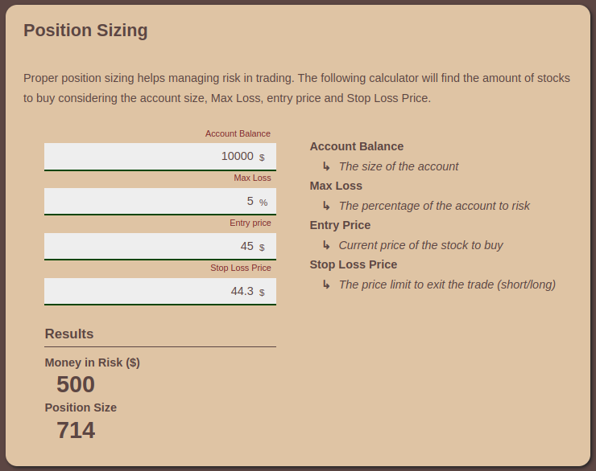
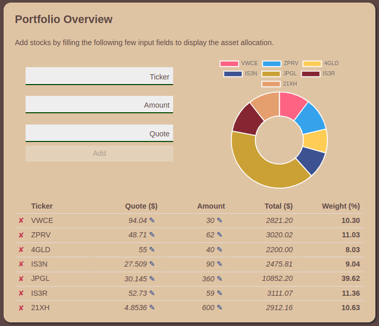

# STOCKer

Basic app to help stock tracking/sizing etc. (http://stocker.klajbar.com/)

## Position sizing

Based on given inputs it will calculate the right position size to buy.
- Account Balance - The max capital of the account
- Max Loss - The desired Max Loss on the trade in percentage
- Entry price - Current price of the stock
- Stop Loss Price - The maximum Stop Loss Price for the stock to close the position

### Example

Account Balance: $10.000
Max Loss: 3%
Entry price: $55
Stop loss: $53

This means that I'm willing to lose maximmum **3%** of my capital in a single trade which is **$300**.
The stock which I'm about to buy has the current price of **$55** and if the price goes down up until **$53** no matter what, I'm closing the position and take the loss.
The result of the calculation is that I'm able to buy **150** of this share. In the worst case scenario I'm closing the position at the price of **$53**. 
If this happens I'm **$2** below the initial price and I'm realizing **150 x $2 = $300** loss.

## Portfolio data

Simple tool to visualize the portfolio and show the current percentage.
Must provide `Ticker`, `Amount`, `Quote` for each stock.
Once stocks are provided it will create a pie chart and a table from the result data.

## Dependencies

- [lit](https://github.com/lit/lit)
- [Chart.js](https://github.com/chartjs/Chart.js)

## Commands

- yarn start - starts dev server on port 3000
- yarn build - builds the app
- yarn format - runs prettier
- yarn lint - runs linter
- yarn deploy - creates sls deployment

## Build tools

- Gulp, Rollup, Serverless plugins

## Files

### Build files

- gulpfile.js - contains the whole build process
- serverless.yml - contains sls template to deploy the project to s3 buckets

### Serverless deployment

- Install Serverless: `npm install -g serverless`
- Run serverless deployment: `yarn deploy`

## TODO

- Have proper design
- Find a way to separate core logic from components
- Create unit tests
- Create Cypress tests